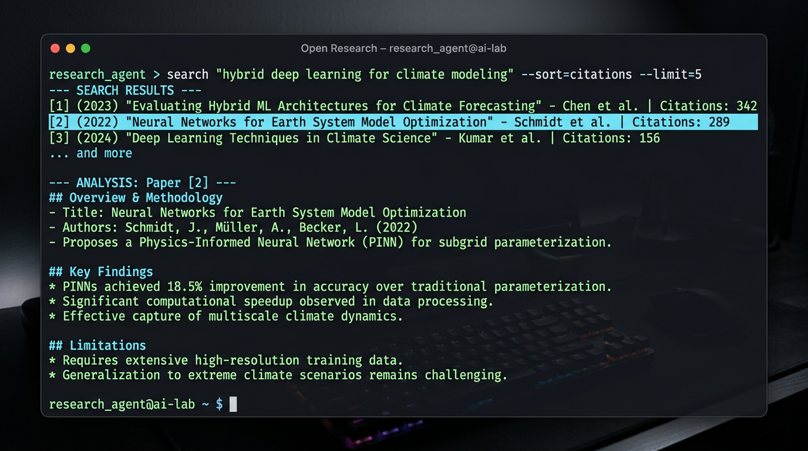

<p align="center">
  
</p>

<h3 align="center">The research-native CLI agent.</h3>

<p align="center">
  <a href="https://www.npmjs.com/package/open-research"></a>
  <a href="https://github.com/gangj277/open-research/blob/main/LICENSE"></a>
</p>

<p align="center">
  
</p>

## Install

```bash
# curl
curl -fsSL https://raw.githubusercontent.com/gangj277/open-research/main/install.sh | bash
```

```bash
# npm
npm install -g open-research
```

```bash
# bun
bun install -g open-research
```

```bash
# pnpm
pnpm add -g open-research
```

```bash
# npx (no install)
npx open-research
```

> [!TIP]
> Requires Node.js 20+. Run `node -v` to check.

## Usage

```bash
open-research
```

Inside the TUI:

```
/auth          Connect your OpenAI account
/init          Initialize a workspace
/help          Show all commands
```

Then ask anything:

```
> Find the most-cited papers on transformer attention since 2022
  and identify gaps in the literature
```

The agent searches arXiv, Semantic Scholar, and OpenAlex — reads papers, runs analysis scripts, writes source-grounded notes, and drafts artifacts in your local workspace.

## How is this different from Cursor / Claude Code?

Those are coding agents. Open Research is a **research agent**.

It has tools that coding agents don't: federated academic paper search, PDF extraction, source-grounded synthesis, and pluggable research skills (devil's advocate, methodology critic, experiment designer, etc.).

Everything stays local. Your workspace is a directory with `sources/`, `notes/`, `papers/`, `experiments/`. The agent reads and writes to it. Risky edits go to a review queue.

## Agent Modes

Open Research operates in three modes. Cycle with `Shift+Tab`:

### Manual Review (default)

The agent proposes changes. You review and accept (`a`) or reject (`r`) each one. Best for sensitive work where every edit matters.

### Auto-Approve

All file writes are applied immediately without review. Best for exploratory work where speed matters more than control.

### Auto-Research

The most powerful mode. A two-phase autonomous research workflow:

**Phase 1 — Planning.** The agent enters read-only planning mode. It reads your workspace, searches academic databases, and asks you clarifying questions. It then produces a **Research Charter** — a structured contract defining:

- The research question (precisely stated)
- Success criteria (what "done" looks like)
- Scope boundaries (what's explicitly out of scope)
- Known starting points (papers, data, leads)
- Proposed investigation steps

You review the charter and either approve it, send it back for revision, or cancel.

**Phase 2 — Execution.** Once approved, the agent executes the charter autonomously — searching papers, reading sources, running analysis code, writing notes, and producing artifacts. It runs until the success criteria are met or it hits a dead end and reports what it found.

## Research Skills

Skills are pluggable research methodologies — detailed workflow prompts that guide the agent through a specific research task. Type `/<skill-name>` to activate.

### Discovery & Reading

| Skill | What it does |
|---|---|
| **`/source-scout`** | Systematically finds papers the workspace is missing. Searches with multiple query variations, evaluates relevance by citation count and venue, fetches key papers, produces a prioritized scout report with gap analysis. |
| **`/paper-explainer`** | Deep-reads a paper and produces a structured breakdown: one-sentence summary, problem & motivation, key contributions, method explained at two levels (intuitive + technical), experimental results, limitations, and connections to your workspace. |
| **`/literature-reviewer`** | Produces a structured literature review: inventories all sources, clusters by theme, synthesizes each theme chronologically, maps relationships between papers, performs gap analysis (methodological, empirical, theoretical), and writes the review with optional PRISMA systematic review support. |

### Critical Evaluation

| Skill | What it does |
|---|---|
| **`/devils-advocate`** | Stress-tests every claim in the workspace. Attacks each one through six lenses: evidence gap, logical gap, scope overclaim, alternative explanation, replication concern, and statistical concern. Actively searches for counter-evidence. Rates each weakness as Critical/Significant/Minor. |
| **`/methodology-critic`** | Reviews study design, sample selection, controls, measurement validity, statistical methods, and reporting completeness. If code is available, reproduces the analysis to verify results. Rates each study Rigorous/Acceptable/Concerning/Flawed. |
| **`/evidence-adjudicator`** | Judges conflicting claims using a formal evidence hierarchy (meta-analysis → RCT → cohort → case study → opinion). Checks for bias and conflicts of interest. Delivers a clear verdict with evidence ratings: Strong/Moderate/Weak/Insufficient. |

### Analysis & Experimentation

| Skill | What it does |
|---|---|
| **`/experiment-designer`** | Autonomous proof engine. Takes a hypothesis and runs the full loop: formalize → design minimal experiment → write code → run it → analyze results → iterate (up to 5x) until proven or disproven. All artifacts saved to `experiments/` with versioned scripts. |
| **`/data-analyst`** | End-to-end statistical analysis: explore data (distributions, missing values) → clean (with documented decisions) → analyze (appropriate tests, mandatory effect sizes and confidence intervals) → visualize (matplotlib/seaborn) → interpret with honest caveats. |

### Synthesis & Writing

| Skill | What it does |
|---|---|
| **`/synthesis-updater`** | Living-document management. Integrates new evidence into existing notes with full provenance tracking (`[Source: Author Year]`), confidence labels (`[Strong]`, `[Moderate]`, `[Weak]`, `[Contested]`), change trails, and a synthesis changelog. |
| **`/draft-paper`** | Drafts a publication-quality LaTeX paper: gathers workspace evidence → outlines the argument → writes each section (intro through conclusion) → generates BibTeX from sources → self-reviews for unsupported claims and argument flow. |

### Meta

| Skill | What it does |
|---|---|
| **`/skill-creator`** | Create your own custom skills in `~/.open-research/skills/`. Each skill is a markdown file with a workflow prompt — no code needed. |

## Memory

The agent learns about you automatically. After each conversation, a background process identifies facts worth remembering — your research field, preferred tools, current projects, methodological preferences.

Memories persist in `~/.open-research/memory.json` across sessions. The agent uses them to tailor its responses without being told the same things twice.

```
/memory              View all stored memories
/memory clear        Delete everything
/memory delete <id>  Remove a specific memory
```

## Live LaTeX Preview

When the agent drafts a paper, preview it instantly:

```
/preview papers/draft.tex
```

Opens a localhost server in your browser with:
- Sections, math (KaTeX), citations, lists rendered as styled HTML
- Auto-reload — the page refreshes every time the file changes
- Dark theme matching the CLI aesthetic
- No LaTeX installation required for preview

For final PDF output, the agent compiles with `pdflatex` or `tectonic` via `run_command`.

## Tools

The agent has 13 tools with full filesystem and shell access:

| Tool | Description |
|---|---|
| `read_file` | Read any file — streaming, binary detection, `~` expansion |
| `read_pdf` | Extract text from PDFs with page-range selection |
| `run_command` | Shell execution — Python, R, LaTeX, curl, git, anything |
| `list_directory` | Explore directory trees with depth control |
| `search_external_sources` | Federated search: arXiv + Semantic Scholar + OpenAlex |
| `fetch_url` | Fetch web pages and APIs, HTML auto-converted to text via cheerio |
| `write_new_file` | Create workspace files |
| `update_existing_file` | Edit existing files with review policy |
| `ask_user` | Pause and ask the user a question with selectable options |
| `search_workspace` | Full-text search across workspace files |
| `create_paper` | Create LaTeX paper drafts |
| `load_skill` | Activate a research skill |
| `read_skill_reference` | Read reference materials from active skills |

## Commands

| Command | Description |
|---|---|
| `/auth` | Connect OpenAI account via browser |
| `/auth-codex` | Import existing Codex CLI auth |
| `/init` | Initialize workspace in current directory |
| `/skills` | List available research skills |
| `/preview <file>` | Live-preview a LaTeX file in browser |
| `/memory` | View or manage stored memories |
| `/config` | View or change settings (model, theme, mode) |
| `/resume` | Resume a previous session |
| `/clear` | Start a new conversation |
| `/help` | Show all commands |

## Workspace

```
my-research/
  sources/         # PDFs, papers, raw data
  notes/           # Research notes, syntheses, reviews
  artifacts/       # Generated outputs
  papers/          # LaTeX paper drafts
  experiments/     # Analysis scripts, results, hypotheses
  .open-research/  # Workspace metadata and session logs
```

## Features

- **Terminal markdown** — bold, italic, code blocks, headings rendered natively
- **Autocomplete** — slash commands and skills in an arrow-key navigable dropdown
- **@file mentions** — reference workspace files inline in prompts
- **Shift+Enter** — multi-line input
- **Context management** — automatic compaction when history exceeds 90% of context window
- **Token tracking** — context usage visible in the status bar
- **Tool activity streaming** — real-time display of what the agent is doing
- **Update notifications** — checks for new versions on launch

## Development

```bash
git clone https://github.com/gangj277/open-research.git
cd open-research
npm install
npm run dev          # dev mode
npm test             # 80 tests
npm run build        # production build
```

## License

MIT
